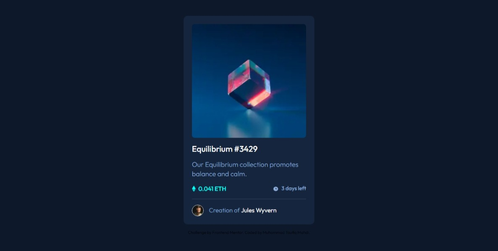
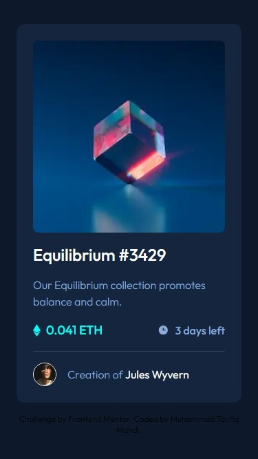

# Frontend Mentor - NFT preview card component solution

This is a solution to the [NFT preview card component challenge on Frontend Mentor](https://www.frontendmentor.io/challenges/nft-preview-card-component-SbdUL_w0U). Frontend Mentor challenges help you improve your coding skills by building realistic projects. 

## Table of contents

- [Overview](#overview)
  - [The challenge](#the-challenge)
  - [Screenshot](#screenshot)
  - [Links](#links)
- [My process](#my-process)
  - [Built with](#built-with)
  - [What I learned](#what-i-learned)
  - [Useful resources](#useful-resources)
- [Author](#author)
- [Acknowledgments](#acknowledgments)

## Overview

### The challenge

Users should be able to:

- View the optimal layout depending on their device's screen size
- See hover states for interactive elements

### Screenshot




### Links

- Solution URL: [Solution](https://www.frontendmentor.io/solutions/nft-preview-card-component-using-next-js-and-typescript-C3QDtfWlyh)
- Live Site URL: [Vercel](https://nft-preview-card-component-next-type-script.vercel.app/)

## My process

### Built with

- Semantic HTML5 markup
- CSS custom properties
- Flexbox
- CSS Grid
- Mobile-first workflow
- [React](https://reactjs.org/) - JS library
- [Next.js](https://nextjs.org/) - React framework
- [Tailwind](https://tailwindcss.com/) - For styles

### What I learned

- How to give a class to a component based on their parent:
```jsx
<div className="relative flex group rounded-lg">
    <Image className="rounded-lg w-full object-contain md:hidden" src="/image-equilibrium.jpg" width={200} height={250} alt="Image of Equilibrium" />
    <Image className="rounded-lg w-full object-contain hidden md:block" src="/image-equilibrium.jpg" width={150} height={200} alt="Image of Equilibrium" />
    <div className="absolute rounded-lg hidden group-hover:block group-hover:cursor-pointer bg-primary-cyan bg-opacity-40 w-full h-full"></div>
    <ViewIcon />
</div>
```

### Useful resources

- [Styling based on parent state](https://tailwindcss.com/docs/hover-focus-and-other-states#styling-based-on-parent-state) - This helped me to create a condition when something happen for a parent, then assign it to the child.

## Author

- Website - [Muhammad Taufiq Mahdi Personal Portfolio](https://taufiqmahdi-personal-portfolio.vercel.app/)
- Frontend Mentor - [@taufiqmahdi](https://www.frontendmentor.io/profile/taufiqmahdi)
- Twitter - [@taufiqmhdi](https://www.twitter.com/taufiqmhdi)